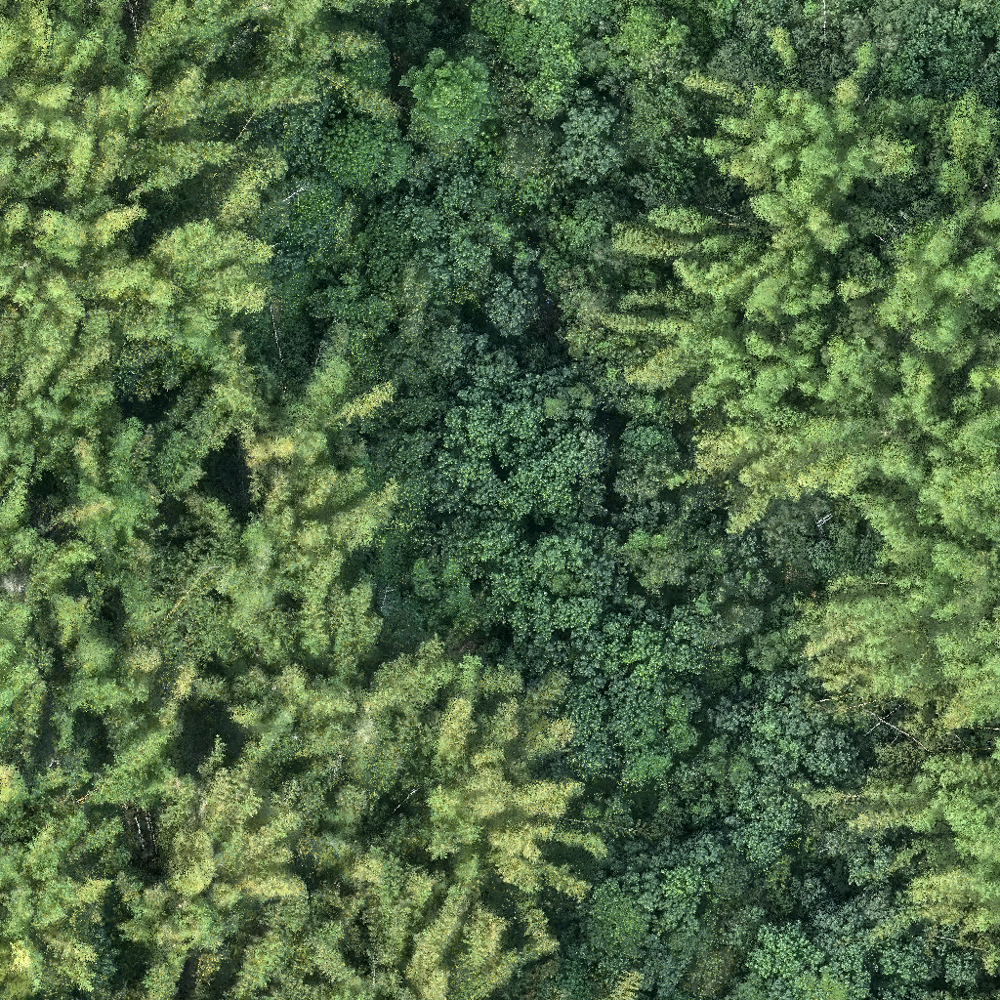
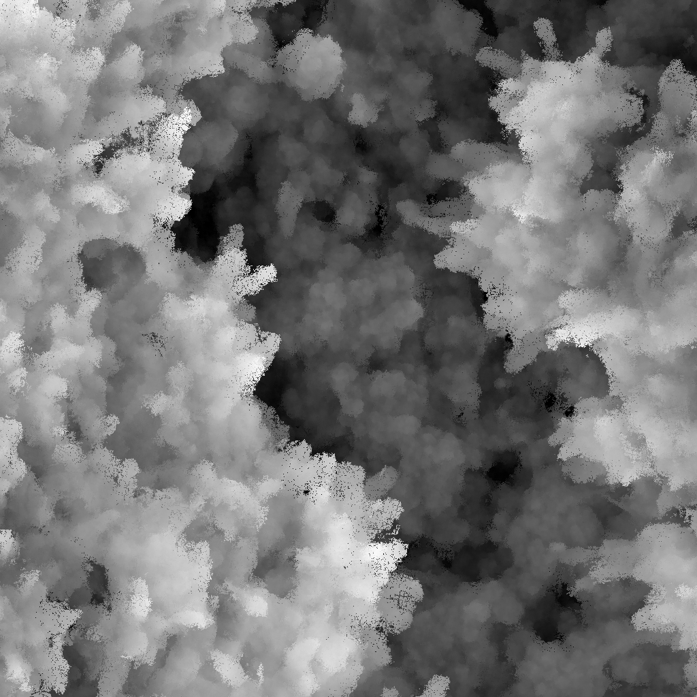
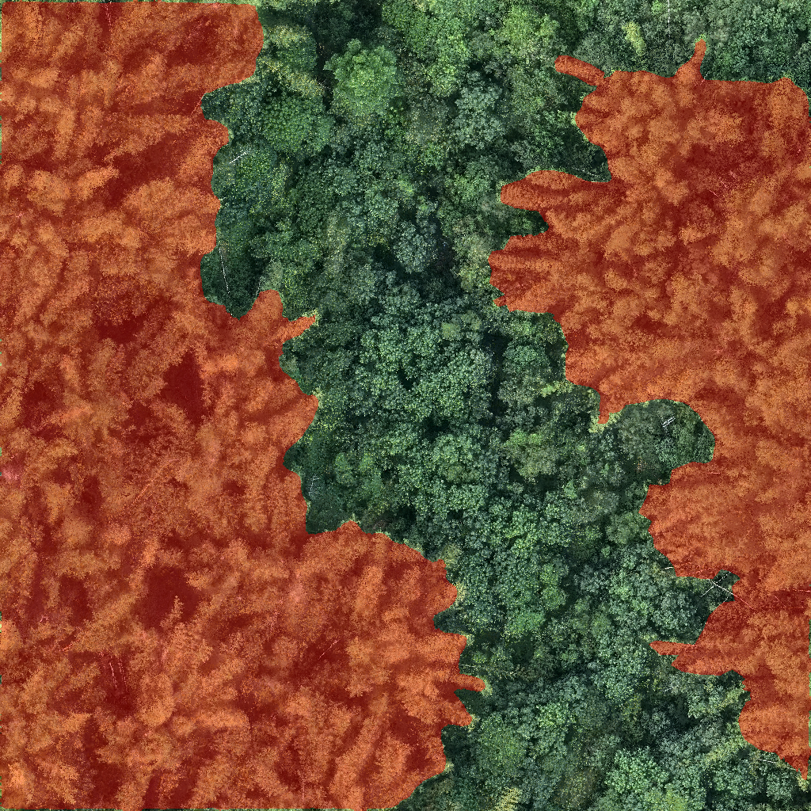

# **Bamboo Forest Mapping by UNet**

This repository presents a complete workflow for bamboo forest mapping using UNet segmentation models trained on multimodal remote sensing imagery. The implementation supports image-based segmentation using single data sources (RGB imagery or canopy height models) as well as fused multimodal data, enabling a systematic evaluation of spectral, structural, and complementary height information for bamboo mapping.

---

## **Dataset Preprocessing**

The workflow supports the following input data modalities:

- RGB imagery  
- Canopy Height Model (CHM)  
- Fusion of RGB and CHM data  

Before training, ensure that your dataset satisfies the requirements outlined below.

### **Directory Structure**

```
data/
├── RGB/
│   └── (all training RGB images)
├── CHM/
│   └── (all training CHM images)
└── masks/
    └── (segmentation masks; filenames must match the training images)
```

### **Preprocessing Requirements**

- All input images (RGB, CHM, and masks) must have the **same spatial resolution and dimensions**.
  - If resizing or format conversion is required, use:
    ```
    utils/resize_and_img_format.py
    ```
- Mask images must be **binary**, containing only two pixel values:
  - `0`   → background  
  - `255` → bamboo  

---

## **Bamboo Forest Dataset and Models**

For demonstration purposes, the complete dataset and trained UNet segmentation models are available from Zenodo:

- [Multimodal bamboo mapping dataset and trained UNet models](https://doi.org/10.5281/zenodo.18150679)

The repository includes:
- `data.zip`: preprocessed RGB, CHM, and annotated image masks
- `models.zip`: UNet models trained using either single data source (RGB or CHM) or fused multimodal inputs

Unzip the dataset and models before use:

```bash
unzip data.zip
unzip models.zip


## **Installation**

Install all required dependencies using:

```bash
pip install -r requirements.txt
```

## **Example Multimodal Inputs and Annotation**

| RGB Image | CHM Image | Ground-Truth Mask |
|-----------|-----------|------------------|
|  |  |  |


## **Model Training and Validation**

Model training and validation are implemented in the following Jupyter Notebook:

- `train_val_models.ipynb`

This notebook covers:
- Dataset loading  
- UNet model configuration  
- Training and validation procedures  
- Performance evaluation  

---

## **Bamboo Mapping (Inference)**

To generate bamboo forest maps using a trained UNet model, run:

- `bamboo_mapping.ipynb`

This notebook performs model inference and visualizes the resulting segmentation maps.

---

## **Contact Information**

- **Prof. Chinsu Lin**  
  Email: chinsu@mail.ncyu.edu.tw  

- **Prof. Wenzhi Liao**  
  Email: wenzhi.liao@ugent.be  
